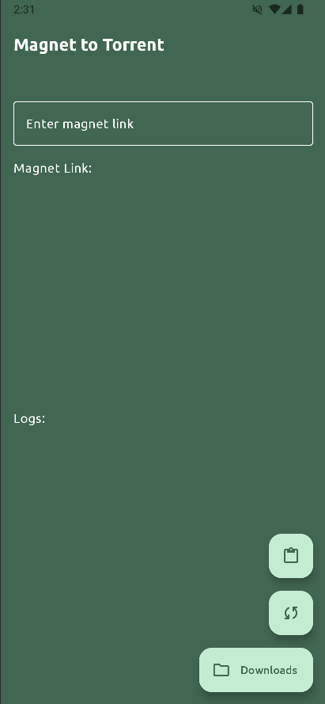
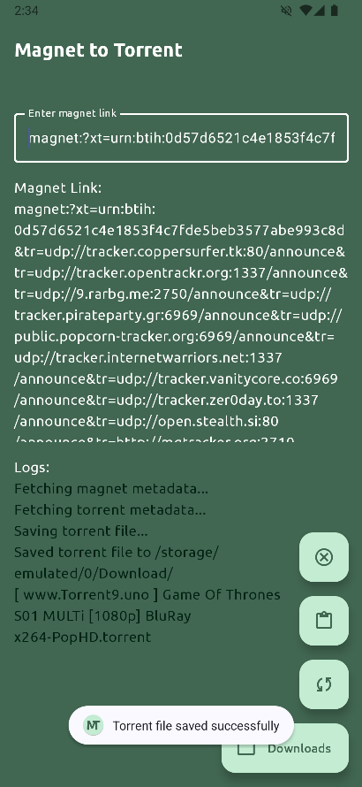

# Magnet to Torrent Converter

Magnet to Torrent Converter is an Android application that allows users to convert magnet links to torrent files. The app fetches the metadata from the magnet link and saves it as a `.torrent` file in the device's download directory.

## Features

- **Convert Magnet Links**: Convert magnet links to torrent files with ease.
- **Clipboard Integration**: Automatically paste the last copied magnet link from the clipboard.
- **Download Manager**: Open the download folder directly from the app.
- **Logs**: View detailed logs of the conversion process.
- **Error Handling**: Provides detailed error messages for better troubleshooting.

## Screenshots




## Installation

1. Clone the repository:
    ```sh
    git clone https://github.com/WH-Yoshi/magnet-to-torrent-converter.git
    ```
2. Open the project in Android Studio.
3. Build and run the app on your Android device or emulator.

## Usage

1. Open the app.
2. Enter a magnet link in the text field or paste the last copied magnet link using the paste button.
3. Click the convert button to start the conversion process.
4. View the logs to see the progress and any errors.
5. Open the download folder to access the saved torrent files.

## Dependencies

- [FrostWire jlibtorrent](https://github.com/frostwire/frostwire-jlibtorrent) - A Java library for working with torrents.
- [AndroidX](https://developer.android.com/jetpack/androidx) - A set of libraries to help you write modern Android apps.

## Contributing

Contributions are welcome! Please open an issue or submit a pull request for any improvements or bug fixes.

## License

This project is licensed under the MIT License. See the [LICENSE](LICENSE) file for details.

## Acknowledgements

- Thanks to the developers of [FrostWire jlibtorrent](https://github.com/frostwire/frostwire-jlibtorrent) for their excellent library.
- Thanks to the Android community for their support and resources.
- Thanks to the developers of the libraries used in this project.
- Thanks to the developers of [Seal](https://github.com/JunkFood02/Seal) app for the inspiration. Design and features are inspired by the Seal app.

## Contact

For any inquiries or support, please contact [absluca419@gmail.com](mailto:absluca419@gmail.com).